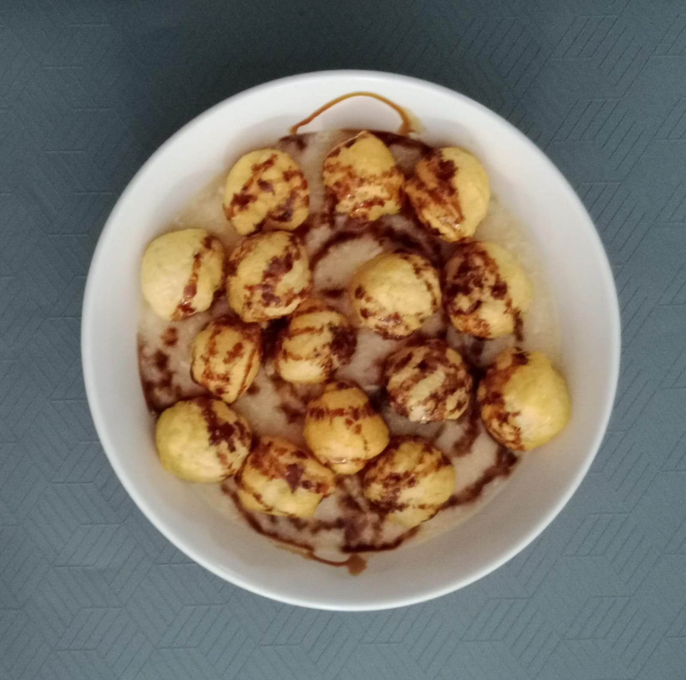
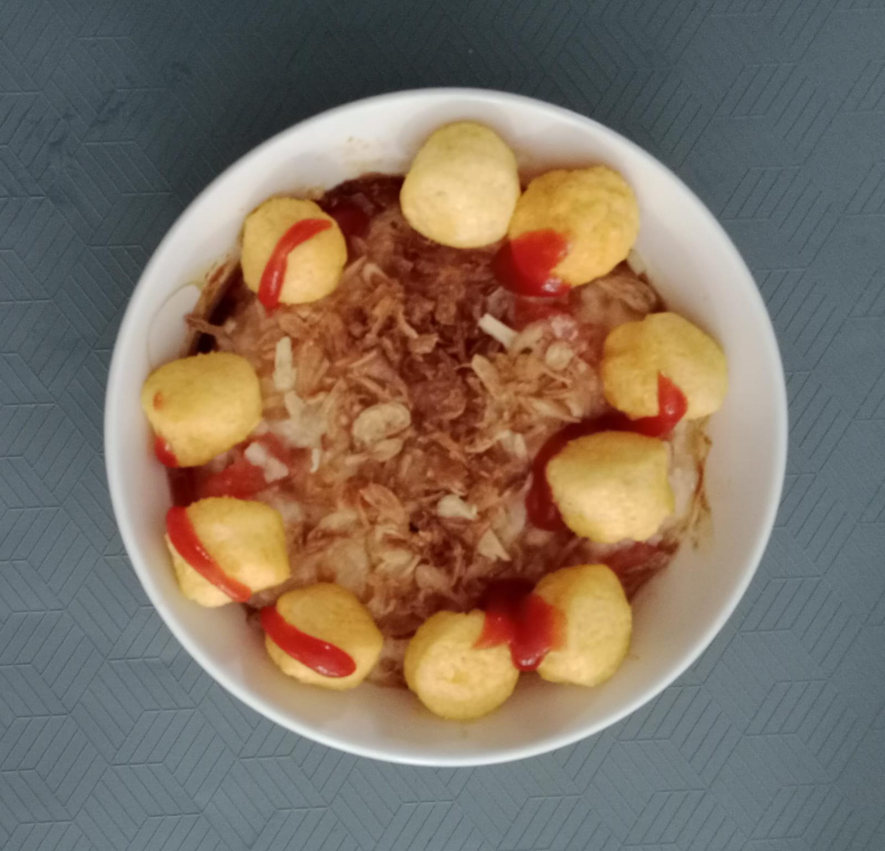
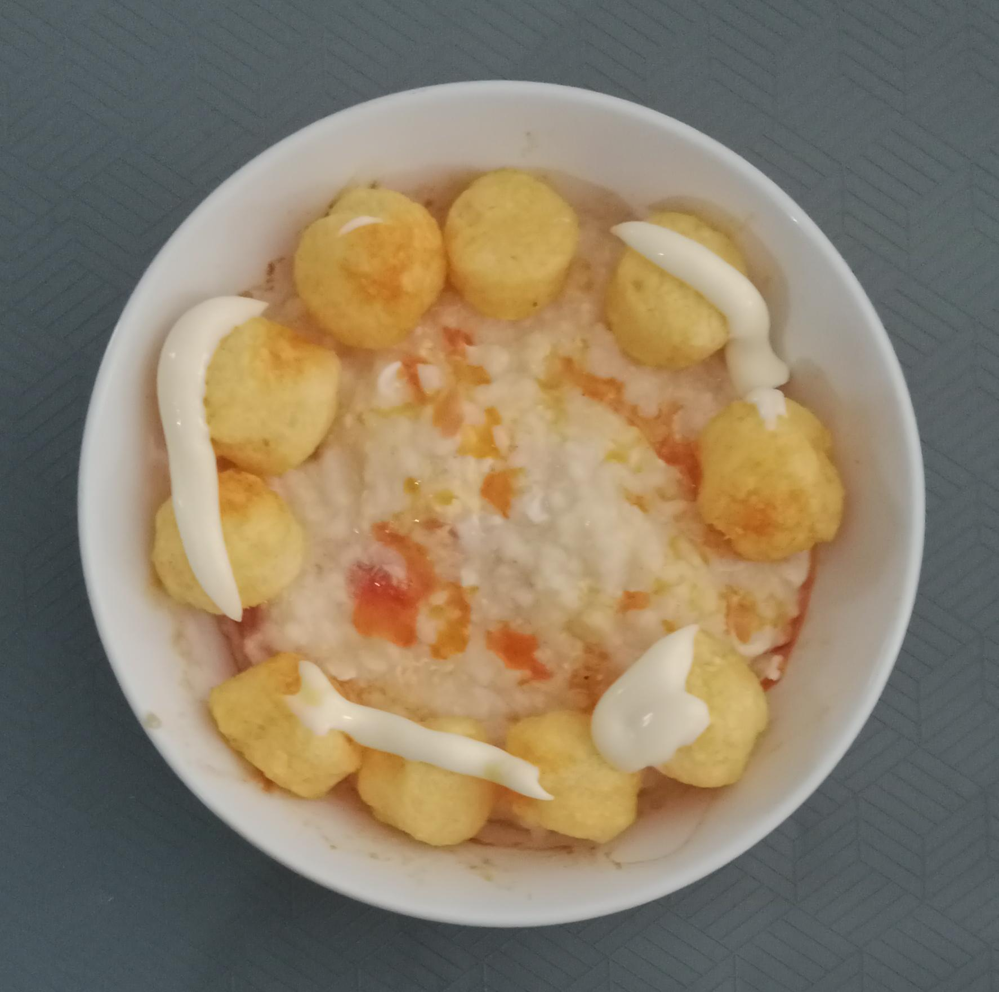

# 01_rice_porridge_egg_tomato
home exp-dishes


## 14-june-2026
Three different toppings






## misc
+ 0908 Problem
```
26f28 % git push
Enumerating objects: 8, done.
Counting objects: 100% (8/8), done.
Delta compression using up to 10 threads
Compressing objects: 100% (6/6), done.
Writing objects: 100% (6/6), 490.37 KiB | 40.86 MiB/s, done.
Total 6 (delta 0), reused 0 (delta 0), pack-reused 0 (from 0)
error: RPC failed; HTTP 408 curl 22 The requested URL returned error: 408
send-pack: unexpected disconnect while reading sideband packet
fatal: the remote end hung up unexpectedly
Everything up-to-date
26f28 %
```
+ 0912 Cancel for the images
```
26f28 % git reset --hard origin           
HEAD is now at 58ddf76 update 01
26f28 %
```
+ 0916 Still
```
26f28 % git commit -am "add images 01" && git push
[main 5528dc2] add images 01
 3 files changed, 0 insertions(+), 0 deletions(-)
 create mode 100644 01/WhatsApp Image 2026-06-14 at 07.32.27.jpeg
 create mode 100644 01/WhatsApp Image 2026-06-14 at 08.03.04.jpeg
 create mode 100644 01/WhatsApp Image 2026-06-14 at 08.15.05.jpeg
Enumerating objects: 8, done.
Counting objects: 100% (8/8), done.
Delta compression using up to 10 threads
Compressing objects: 100% (6/6), done.
Writing objects: 100% (6/6), 490.37 KiB | 40.86 MiB/s, done.
Total 6 (delta 0), reused 0 (delta 0), pack-reused 0 (from 0)
error: RPC failed; HTTP 408 curl 22 The requested URL returned error: 408
send-pack: unexpected disconnect while reading sideband packet
fatal: the remote end hung up unexpectedly
Everything up-to-date
```
+ 0918 Ask GPT-5.5


## 15-jun-2026
+ 1048 Try at work to download the files again.
+ 1049 Commit.
+ 1728 Fin conclict.
